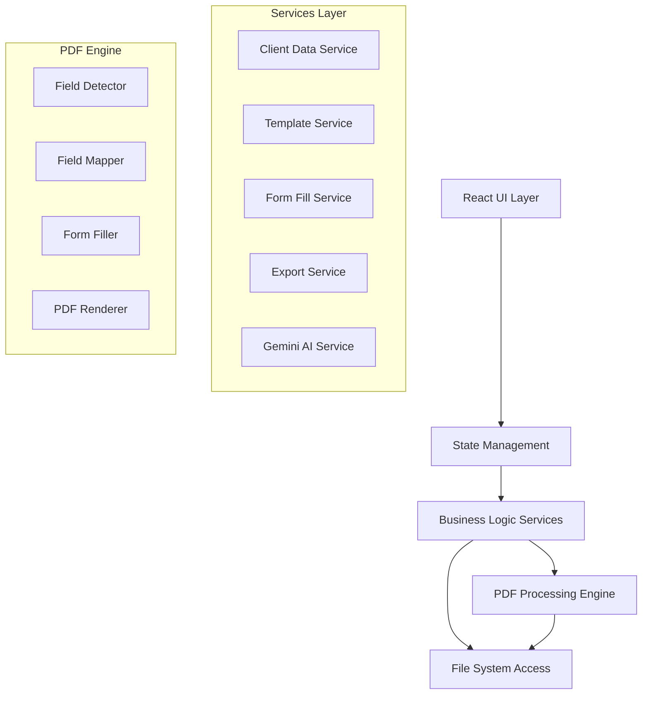
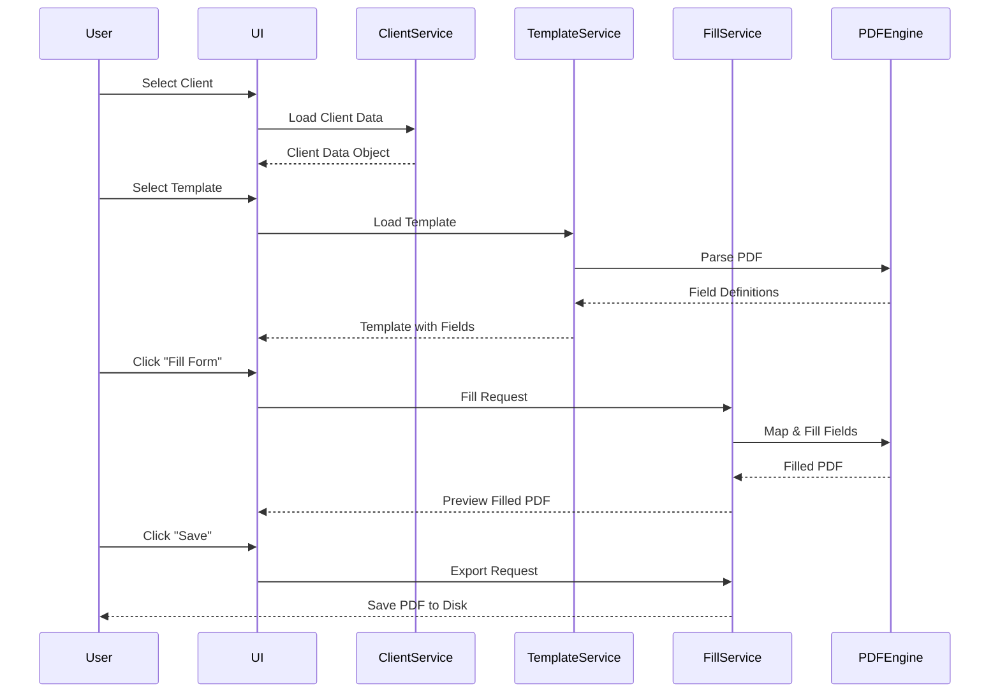

# Design Document

## Overview

The PDF Auto-Filler is a desktop application built with Electron, React, and TypeScript that provides a seamless experience for automatically filling PDF forms with client data. The application prioritizes ease of use with a one-click installation via packaged executables and a modern, intuitive interface.

The system architecture separates concerns between the UI layer (React), business logic (TypeScript services), and PDF processing (pdf-lib, PDF.js). Client data and PDF templates are stored locally, with no external data transmission, ensuring privacy and security.

## Architecture

### Technology Stack

**Frontend:**
- React 18+ with TypeScript for UI components
- Tailwind CSS for styling and responsive design
- React Router for navigation (if multi-page)
- Framer Motion for smooth animations and transitions

**Desktop Framework:**
- Electron for cross-platform desktop application
- Electron Builder for packaging and distribution

**PDF Processing:**
- pdf-lib for PDF manipulation and form filling
- PDF.js for PDF rendering and preview
- Tesseract.js for OCR when PDFs lack form fields

**Data Handling:**
- PapaParse for CSV parsing
- xlsx for Excel file reading
- Native JSON parsing for JSON files

**AI Integration:**
- Google Gemini API for intelligent field mapping
- @google/generative-ai SDK for API communication
- Secure credential storage using electron-store with encryption

**Build & Distribution:**
- Vite for fast development and building
- Electron Builder for creating installers (DMG for macOS, EXE for Windows, AppImage/deb for Linux)

### Application Architecture



### Data Flow



## Components and Interfaces

### UI Components

**Main Layout:**
- `App.tsx` - Root component with routing and global state
- `Sidebar.tsx` - Navigation and quick actions
- `MainContent.tsx` - Primary workspace area
- `StatusBar.tsx` - Status messages and notifications

**Client Management:**
- `ClientList.tsx` - Display all available clients
- `ClientCard.tsx` - Individual client preview card
- `ClientDetail.tsx` - Full client information view
- `ClientImport.tsx` - Import client data files

**Template Management:**
- `TemplateLibrary.tsx` - Grid/list of available templates
- `TemplateCard.tsx` - Template preview with metadata
- `TemplateUpload.tsx` - Add new PDF templates
- `TemplatePreview.tsx` - PDF preview with zoom/navigation

**Form Filling:**
- `FillWorkspace.tsx` - Main form filling interface
- `FieldMapper.tsx` - Manual field mapping interface
- `FormPreview.tsx` - Live preview of filled form
- `FieldEditor.tsx` - Edit individual field values

**Export:**
- `ExportDialog.tsx` - Configure export options
- `BatchProcessor.tsx` - Batch fill multiple forms
- `ExportHistory.tsx` - View recently exported documents

**Settings:**
- `SettingsPanel.tsx` - Application settings and preferences
- `ApiKeyConfig.tsx` - Gemini API key configuration
- `MappingPreferences.tsx` - AI mapping preferences and thresholds

### Service Interfaces

```typescript
// Client Data Service
interface IClientDataService {
  loadClientsFromFile(filePath: string): Promise<Client[]>;
  getClient(id: string): Client | null;
  getAllClients(): Client[];
  validateClientData(client: Client): ValidationResult;
  watchClientFiles(directory: string): void;
}

// Template Service
interface ITemplateService {
  loadTemplate(filePath: string): Promise<PDFTemplate>;
  getAllTemplates(): PDFTemplate[];
  categorizeTemplate(template: PDFTemplate): string;
  getTemplatePreview(templateId: string): Promise<string>;
  deleteTemplate(templateId: string): void;
}

// Form Fill Service
interface IFormFillService {
  detectFields(pdf: PDFDocument): Promise<FormField[]>;
  mapFieldsToClient(fields: FormField[], client: Client): FieldMapping[];
  fillForm(template: PDFTemplate, mapping: FieldMapping[]): Promise<PDFDocument>;
  validateFilledForm(pdf: PDFDocument): ValidationResult;
}

// Export Service
interface IExportService {
  exportPDF(pdf: PDFDocument, options: ExportOptions): Promise<string>;
  batchExport(requests: ExportRequest[]): Promise<ExportResult[]>;
  getExportHistory(): ExportRecord[];
}

// Gemini AI Service
interface IGeminiService {
  suggestFieldMapping(fieldName: string, fieldContext: string, availableClientFields: string[]): Promise<MappingSuggestion>;
  interpretFieldPurpose(fieldName: string, surroundingText: string): Promise<FieldInterpretation>;
  validateMapping(field: FormField, clientField: string, sampleValue: any): Promise<ValidationScore>;
  isConfigured(): boolean;
  setApiKey(key: string): Promise<void>;
}
```

## Data Models

### Client Data Model

```typescript
interface Client {
  id: string;
  firstName: string;
  lastName: string;
  dateOfBirth?: string;
  email?: string;
  phone?: string;
  address?: Address;
  customFields: Record<string, any>;
  metadata: {
    source: string;
    lastUpdated: Date;
  };
}

interface Address {
  street?: string;
  city?: string;
  state?: string;
  zipCode?: string;
  country?: string;
}
```

### PDF Template Model

```typescript
interface PDFTemplate {
  id: string;
  name: string;
  category: string;
  filePath: string;
  fields: FormField[];
  thumbnail?: string;
  metadata: {
    pageCount: number;
    fileSize: number;
    addedDate: Date;
  };
}

interface FormField {
  id: string;
  name: string;
  type: 'text' | 'checkbox' | 'radio' | 'dropdown' | 'signature' | 'date';
  position: { page: number; x: number; y: number; width: number; height: number };
  required: boolean;
  maxLength?: number;
  options?: string[];
  suggestedMapping?: string;
}
```

### Field Mapping Model

```typescript
interface FieldMapping {
  fieldId: string;
  fieldName: string;
  clientDataPath: string;
  value: any;
  confidence: number;
  manuallyMapped: boolean;
  transformer?: (value: any) => string;
}

interface MappingRule {
  pattern: RegExp;
  clientField: string;
  transformer?: (value: any) => string;
}

interface MappingSuggestion {
  suggestedField: string;
  confidence: number;
  reasoning: string;
  alternatives: Array<{ field: string; confidence: number }>;
}

interface FieldInterpretation {
  purpose: string;
  expectedDataType: string;
  suggestedFormat: string;
  confidence: number;
}
```

### Export Configuration

```typescript
interface ExportOptions {
  outputDirectory: string;
  fileNamePattern: string;
  flattenForm: boolean;
  openAfterExport: boolean;
  organizationStrategy: 'none' | 'by-client' | 'by-date' | 'by-template';
}

interface ExportResult {
  success: boolean;
  filePath?: string;
  error?: string;
  timestamp: Date;
}
```

## Error Handling

### Error Categories

1. **File System Errors**
   - File not found
   - Permission denied
   - Invalid file format
   - Corrupted files

2. **Data Validation Errors**
   - Missing required fields
   - Invalid data format
   - Data type mismatches

3. **PDF Processing Errors**
   - Corrupted PDF
   - Unsupported PDF features
   - Field detection failures
   - Form filling errors

4. **Application Errors**
   - Out of memory
   - Unexpected exceptions
   - State corruption

### Error Handling Strategy

```typescript
class AppError extends Error {
  constructor(
    message: string,
    public code: string,
    public severity: 'info' | 'warning' | 'error' | 'critical',
    public userMessage: string,
    public recoverable: boolean = true
  ) {
    super(message);
  }
}

// Error Handler Service
interface IErrorHandler {
  handleError(error: AppError): void;
  showUserMessage(message: string, type: 'success' | 'error' | 'warning' | 'info'): void;
  logError(error: Error, context: any): void;
}
```

**User-Facing Error Messages:**
- Clear, non-technical language
- Actionable suggestions for resolution
- Option to view technical details if needed
- Automatic error reporting (with user consent)

## Testing Strategy

### Unit Tests
- Service layer logic (client data parsing, field mapping, PDF processing)
- Data validation functions
- Utility functions and transformers
- State management logic

**Tools:** Vitest, Testing Library

### Integration Tests
- File system operations
- PDF processing pipeline
- End-to-end form filling workflow
- Export functionality

**Tools:** Vitest, Playwright

### UI Tests
- Component rendering
- User interactions
- Navigation flows
- Responsive behavior

**Tools:** React Testing Library, Vitest

### Manual Testing
- Installation on different operating systems
- Performance with large PDFs and datasets
- UI/UX validation
- Accessibility testing

### Test Coverage Goals
- Minimum 80% code coverage for services
- 100% coverage for critical paths (form filling, export)
- All error handling paths tested

## UI/UX Design Principles

### Visual Design
- **Color Scheme:** Modern, professional palette with accent colors for actions
  - Primary: Blue (#3B82F6)
  - Success: Green (#10B981)
  - Warning: Amber (#F59E0B)
  - Error: Red (#EF4444)
  - Neutral: Gray scale for backgrounds and text

- **Typography:** Clean, readable fonts
  - Headings: Inter or SF Pro
  - Body: System fonts for performance

- **Spacing:** Consistent 8px grid system

- **Animations:** Subtle, purposeful
  - Page transitions: 200ms ease
  - Hover effects: 150ms ease
  - Loading states: Smooth spinners/skeletons

### Interaction Patterns
- Drag-and-drop for file imports
- Keyboard shortcuts for power users
- Context menus for quick actions
- Undo/redo support where applicable
- Auto-save for work in progress

### Accessibility
- WCAG 2.1 AA compliance
- Keyboard navigation support
- Screen reader compatibility
- High contrast mode support
- Focus indicators on all interactive elements

## Performance Considerations

### Optimization Strategies
1. **Lazy Loading:** Load templates and client data on demand
2. **Virtual Scrolling:** For large lists of clients/templates
3. **PDF Streaming:** Process large PDFs in chunks
4. **Caching:** Cache parsed PDFs and field mappings
5. **Web Workers:** Offload PDF processing to background threads
6. **Debouncing:** For search and filter operations

### Performance Targets
- Application launch: < 3 seconds
- PDF preview render: < 1 second for typical documents
- Form fill operation: < 2 seconds
- Export operation: < 3 seconds per document

## Security Considerations

### Data Protection
- All data processing happens locally
- Client PII never sent to external APIs
- Only field names and structure sent to Gemini for mapping suggestions
- API keys stored securely using OS credential manager (keytar)
- Secure file system permissions
- Memory cleared after operations
- No telemetry without explicit consent
- User can disable AI features entirely for offline/privacy mode

### Input Validation
- Sanitize all file inputs
- Validate PDF structure before processing
- Prevent path traversal attacks
- Limit file sizes to prevent DoS

### Update Mechanism
- Signed updates only
- Verify update integrity
- User-controlled update schedule
- Rollback capability

## Deployment & Distribution

### Packaging
- **macOS:** DMG with code signing
- **Windows:** NSIS installer with code signing
- **Linux:** AppImage and .deb packages

### Auto-Update
- Electron's autoUpdater
- Check for updates on launch (optional)
- Background download
- Install on next restart

### Installation Size Target
- < 150MB installed size
- < 80MB download size (compressed)

## Future Enhancements (Out of Scope for v1)

- Cloud sync for templates and client data
- Template marketplace
- Advanced field mapping with ML
- Digital signature support
- Multi-language support
- Plugin system for custom transformers
- Mobile companion app
- Collaboration features
